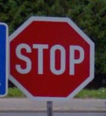

# **Traffic Sign Recognition** 

## README

---

**Build a Traffic Sign Recognition Project**

The goal of this project is to build classifier model (based on a convolutional neural 
network architecture), which is capagle to recognize and classify images of traffic signs.
  

The goals / steps of this project are the following:

* Load the data set (see below for links to the project data set)
* Explore, summarize and visualize the data set
* Design, train and test a model architecture
* Use the model to make predictions on new images
* Analyze the softmax probabilities of the new images
* Summarize the results with a written report

## Rubric Points
  
---
### Writeup / README

In this README, we address the following poinds:

1. Dataset summary & exploration
2. Design and test a model architecture 
3. Test a model on new images 

### Data Set Summary & Exploration

Three separate datasets are provided, for training, validation and testing, containing
colored images of traffic signs, rescaled to 32x32 pixels.  

* The size of training set is 34799
* The size of the validation set is 4410
* The size of test set is 12630
* The shape of a traffic sign image is (32, 32, 3)
* The number of unique classes/labels in the data set is 43

---

In the following figure, we can see the distributions of the distinct signs in 
the training, validation and testing datasets:

[image1]: ./plots/distributions_labels.png
![][image1]

We can also observe some samples of the different images, present in the training dataset:

[image2]: ./plots/sample_signs.png
![][image2]

### Design and Test a Model Architecture

In the preprocessing phase, different techniques have been applied:

1. Image Gaussian bluring
2. Conversion of the RGB to YUV channels
3. Histogram equilization of the Y-channel

Here is a visualization of the original image, the output of the two single preprocessing functions, and their final combination:

[image3]: ./plots/preprocessed_images.png
![][image3]

Furthermore, we augmented the training data by adding 5 more distored images, for each one, present in the original training data. The distorsion has been done by means of the following functions:

1. Random rotation of an angle between -30° and 30° degrees
2. Random scaling of the x and y axis of the original image

The image distorsion (as well as the results from the two single functions) can be visualized in the following image:

[image4]: ./plots/distorted_images.png
![][image4]

Finally, we provide a visualization of the original and final (preprocessed and distorted image):

[image5]: ./plots/final_preprocessed_image.png
![][image5]

---

The model architecture, used in this project, is the standard LeNet architecture, plus additional dropout layers:

| Layer	|	Description	| 
|:-------:|:--------------:| 
| Input   | 32x32x1 Y-channel image | 
| Convolution 5x5 | 5x5 stride, valid padding, outputs 28x28x6 |
| RELU	|						|
| Max pooling	 | 2x2 stride, valid padding, outputs 14x14x6 |
| Convolution 5x5 | 5x5 stride, valid padding, outputs 10x10x16 |
| RELU	|						|
| Max pooling	 | 2x2 stride, same padding, outputs 5x5x16 | 
| Fully connected | Input: 400, Output: 120 |   
| RELU	|						|
| Dropout	| Keep probability: 0.7 |
| Fully connected | Input: 120, Output: 80 |   
| RELU	|						|
| Dropout	| Keep probability: 0.7 |  
| Fully connected | Input: 80, Output: 43 |   		
 For training the model, an Adam optimizer has been used, with 150 epochs, batch size of 128 and learning rate of 0.0001.

The final accuracy of the model on the three datasets is as follows:

| Dataset	|	Accuracy	| 
|:-------:|:--------------:| 
| Training   | 0.900 | 
| Validation | 0.932 |
| Test	|	0.902	|

The fact that the training accuracy is lowet than the validation one, is due to the fact that additional distorted images have been used, some of them with significantly lower quality (mostly due to image shifting)

The usage of the LeNet architecture has been justified by its already very good performance. The preprocessing functions utilized, have been suggested in the following [paper](http://yann.lecun.com/exdb/publis/pdf/sermanet-ijcnn-11.pdf)

### Test a Model on New Images

In order to test our model on a new dataset, we selected 6 new images, downloaded from internet:

[image6]: ./plots/test_images.png
![][image6]

Note that we have included an image, not present in the original datasets.

After running the model on the selected images, the following predictions have been obtained:

| Image	|	Sign	| Predicted Sign |
|:-------:|:--------------:|:--------------:| 
| | Stop |  Stop |
| | No entry |  No entry |
| | Speed limit (50km/h) |  Speed limit (50km/h) |
| | Yield |  Yield |
| | Sharp turn left |  Priority road |
| | Speed limit (70km/h) |  Speed limit (70km/h) | 

We observe that the "Sharp turn left" sign has been classified as "Yield", as it was not present in the original datasets, so the has interpreted it as the closest sign by shape and color.

Finally, we provide the top 5 prediction probabilities in the following image:

[image7]: ./plots/signs_probabilities.png
![][image7]

